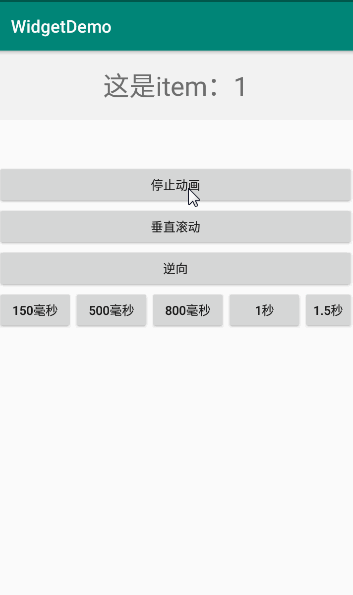

# RecyclerViewPagerDemo
RecyclerViewPager:1.0-beta


### ***RecyclerView实现ViewPager效果***

<h3>效果图：</h3>

<div align="center">


</div>


使用和ViewPager基本一样

#### 
```
viewPager.setAdapter(PagerAdapter);//适配器用PagerAdapter的两个子类，对应Fragment和View的
viewPager.setOrientation(RecyclerViewPager.HORIZONTAL);//指定方向
viewPager.setCurrentItem(position, isAnimator);//isAnimator是否动画
viewPager.setScrollEnable(isScrollEnable));//是否可以滚动
viewPager.setDuration(500);//设置滚动时间，默认300ms
```

#### PageChanged监听
```
viewPager.setOnPageChangeListener(new RecyclerViewPager.OnPageChangeListener() {
            @Override
            public void onPageScrolled(int position, float positionOffset, int positionOffsetPixels) {
                Log.d(TAG, "onPageScrolled: " + position + "===" + positionOffset + "==" + positionOffsetPixels);
            }

            @Override
            public void onPageSelected(int position) {
                Log.d(TAG, "onPageSelected: " + position);
                bottomNavigationView.setSelectedItemId(bottomNavigationView.getMenu().getItem(position).getItemId());
            }

            @Override
            public void onPageScrollStateChanged(int state) {
                Log.d(TAG, "onPageScrollStateChanged: " + state);
            }
        });
```

#### PageTransformer
```
viewPager.setPageTransformer((view, position) -> {
            Log.d(TAG, "transformPage: " + position + "===" + view);
            if (isTransformer) {
                float scaleFactor = Math.max(MIN_SCALE, position);
                view.setScaleX(scaleFactor);
                view.setScaleY(scaleFactor);
            } else {
                view.setScaleX(1);
                view.setScaleY(1);
            }
        });
```

#### Fragment的adapter
```
    static class DemoFragmentRecyclerPagerAdapter extends FragmentRecyclerPagerAdapter {

        DemoFragmentRecyclerPagerAdapter(FragmentManager fm) {
            super(fm);
        }

        @Override
        public Fragment createFragment(int position) {
            //创建position位置的Fragment
            return TestFragment.newInstance("这是fragment: " + position);
        }

        @Override
        protected String createFragmentTag(int viewId, int position) {
            return super.createFragmentTag(viewId, position);
        }
    }
```

#### View的adapter
```
    class DemoViewAdapter extends RecyclerPagerAdapter<String> {

        @Override
        public View instantiateItem(@NonNull ViewGroup parent, int viewType) {
            return LayoutInflater.from(parent.getContext()).inflate(R.layout.test_item, parent, false);
        }

        @Override
        public void convert(@NonNull RecyclerPagerAdapter.ViewHolder viewHolder, String item) {
            TextView textView = viewHolder.getView(R.id.textView);
            textView.setText(item);
        }
    }
```